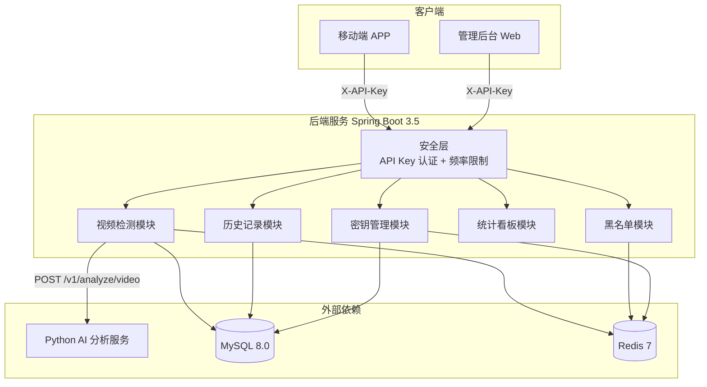
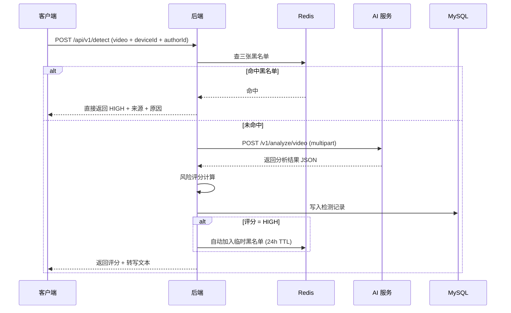
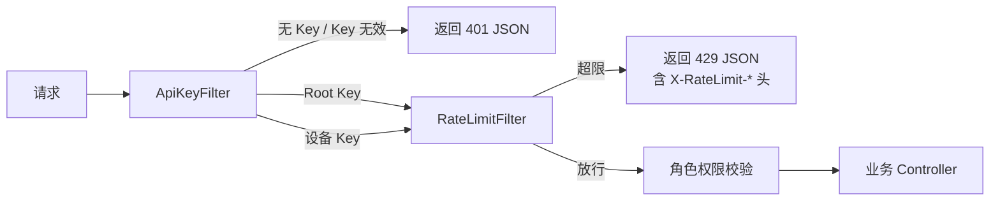

# 短视频反诈后端 — 开发进度说明

> 面向 AI 端 / APP 端 / 产品经理，介绍后端目前已完成的模块与能力。

---

## 一、整体架构



---

## 二、已完成的核心能力

### 1. 视频检测（同步 + 异步）

**同步检测**：`POST /api/v1/detect`
- 接收短视频 MP4 文件，校验文件格式（MIME、扩展名、MP4 魔数字节）
- 流程：黑名单检查 → AI 分析 → 风险评分 → 入库 → 高危自动加入临时黑名单
- 命中黑名单直接返回 HIGH，不走 AI，不写 DB（节省开销）

**异步检测**：`POST /api/v1/detect/async` + `GET /api/v1/detect/{taskId}/status`
- 提交后立即返回任务 ID，后台通过 Redis Stream 消费队列异步处理
- 支持任务重试（最多 3 次），失败任务进入死信队列（DLQ）
- 任务状态可轮询查询（PENDING → PROCESSING → DONE / FAILED）

**风险评分公式**：

```
score = 0.7 × AI画面异常概率 + 0.3 × 暴力内容概率

score >= 0.6  → HIGH（高风险）
score >= 0.3  → MEDIUM（中风险）
score  < 0.3  → SAFE（安全）

关键词命中 → 直接 HIGH，score = 1.0
```



---

### 2. 三级黑名单体系

全部存储在 Redis 中，按优先级依次检查：

| 优先级 | 名称 | 存储方式 | 生命周期 | 来源 |
|--------|------|----------|----------|------|
| 1（最高） | 官方黑名单 `authority` | Redis Set | 永久 | 官方平台公告同步（接口未找到） |
| 2 | 全局黑名单 `global` | Redis Set | 永久 | 管理员手动添加 |
| 3 | 临时黑名单 `temp` | Redis String 键 | 24 小时自动过期 | 系统检测到 HIGH 自动加入 |

**已支持操作**：
- 三类黑名单的独立 CRUD（增/删/查/列表）
- 单个 authorId 聚合查询：返回是否命中和命中了哪一级
- 临时黑名单使用 `SCAN` 遍历，TTL 剩余时间可查

---

### 3. 检测历史查询

`GET /api/v1/history?deviceId={id}`
- **游标翻页（增量同步）**：传 `afterId`，返回该 ID 之后的新记录，适合 APP 下拉刷新
- **传统翻页（分页浏览）**：传 `page` + `size`，适合管理后台翻页
- **组合筛选**：可按 `authorId`、`riskLevel`、时间范围（`startDate`/`endDate`）过滤
- 每页 1~100 条可配，默认 20 条

---

### 4. 数据统计看板

`GET /api/v1/stats`

提供仪表盘所需的聚合指标：
- 各类风险等级（HIGH / MEDIUM / SAFE）检测数量
- 黑名单命中次数
- AI 服务平均调用耗时
- 各黑名单当前条目数

底层基于 Micrometer 指标采集，暴露到 Prometheus（`/actuator/prometheus`）。

---

### 5. API 密钥管理

| 端点 | 功能 |
|------|------|
| `POST /api/v1/keys/register` | 设备自注册：提交 deviceId，自动生成 API Key，默认权限 DETECT + HISTORY，限流 20 次/分 |
| `GET /api/v1/keys/` | 管理员列出所有密钥 |
| `POST /api/v1/keys/` | 管理员创建密钥（可指定权限和限流配额） |
| `PUT /api/v1/keys/{id}` | 修改密钥（权限、名称、限流等） |
| `POST /api/v1/keys/{id}/revoke` | 吊销密钥（可逆） |
| `DELETE /api/v1/keys/{id}` | 删除密钥（不可逆） |

密钥缓存于 Redis（5 分钟 TTL），源数据存 MySQL。Redis 不可用时自动降级查数据库。

---

### 6. 安全机制



- **无状态认证**：基于 `X-API-Key` 请求头，无 Session，CSRF 禁用
- **角色权限**：
  - `ROLE_DETECT`：检测相关接口
  - `ROLE_HISTORY`：历史查询接口
  - `ROLE_ADMIN`：黑名单管理、密钥管理、数据统计
- **滑动窗口限流**：每 Key 独立限流，默认 20 次/分，Root Key 不限流
- **统计一致性**：限流计数器与检测计量均走 Micrometer，统一口径
- **健康检查**：`/actuator/health` 无需认证，可供 K8s / Docker 探活

---

### 7. 管理后台 Web（aiscanner-admin）

已搭建 Vue 3 + TypeScript + Element Plus 管理后台 SPA：

| 页面 | 功能 |
|------|------|
| 登录页 | API Key 登录 |
| 仪表盘 | 风险分布图表（ECharts）、检测量趋势 |
| 检测记录 | 历史数据浏览、筛选、翻页 |
| 黑名单管理 | 三张黑名单独立 CRUD |
| API 密钥 | 密钥列表、创建、吊销、删除 |
| 系统健康 | AI 服务、数据库、Redis 状态展示 |

前端已对接所有后端 API，通过 Vite 代理转发请求。

---

### 8. AI 服务对接

- AI 服务调用地址、超时时间、重试策略均已配置化
- **重试机制**：连接错误和 5xx 错误自动重试 3 次（间隔 1s / 2s / 4s 指数退避），4xx 不重试
- AI 服务不可用时返回前端友好错误信息
- 健康检查独立暴露，监控系统可直接拉取 AI 连通状态
- 提供 `mock_ai_server.py` 可用于本地开发调试（无需真实 AI 模型）

---

### 9. 部署就绪

- **Docker 多阶段构建**：编译阶段 Maven + JDK 25，运行阶段 JRE Alpine，镜像轻量
- **docker-compose 一键启动**：MySQL + Redis + Spring Boot 三服务编排，健康检查依赖等待
- **Flyway 数据库迁移**：建表脚本版本化管理，首次启动自动执行
- **环境变量驱动配置**：数据库密码、Redis 地址、AI 服务 URL 等均通过环境变量注入
- **视频文件落盘**：异步检测流程支持视频文件本地存储，路径可配

---

## 三、API 接口速查

| 方法 | 路径 | 权限 | 说明 |
|------|------|------|------|
| `POST` | `/api/v1/detect` | DETECT | 同步视频检测 |
| `POST` | `/api/v1/detect/async` | DETECT | 异步视频检测 |
| `GET` | `/api/v1/detect/{taskId}/status` | DETECT | 查询异步任务状态 |
| `GET` | `/api/v1/history` | HISTORY | 查询检测历史（支持游标/分页/多条件筛选） |
| `GET` | `/api/v1/stats` | ADMIN | 数据统计看板 |
| `GET/POST/DELETE` | `/api/v1/blacklist/{authority\|global\|temp}` | ADMIN | 黑名单 CRUD |
| `GET` | `/api/v1/blacklist/check/{authorId}` | ADMIN | 查询某作者黑名单命中状态 |
| `POST` | `/api/v1/keys/register` | —（免鉴权） | 设备注册获取 API Key |
| `GET/POST/PUT/DELETE` | `/api/v1/keys/*` | ADMIN | 密钥管理 |
| `GET` | `/actuator/health` | —（免鉴权） | 健康检查 |
| `GET` | `/actuator/prometheus` | —（免鉴权） | Prometheus 指标暴露 |

